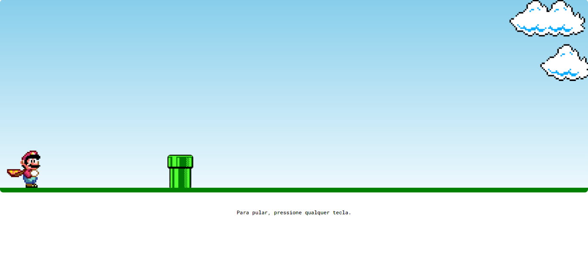

# Mario-Jump

## Sobre o projeto 
Simples jogo do Mario desenvolvido a fim de que se possa praticar os conhecimentos em html, css e javascript. Aproveitem!

## Tecnologias utilizadas

- HTML
- CSS
- JAVASCRIPT

## Versionamento de código 
- Git

## Serviços utilizados 
- GitHub

## Como funciona:

O mario vai correr em linha reta na horizontal. Mas para que ele consiga sobreviver, o usuario deve apertar qualquer tecla do teclado para que ele pule e continue correndo. Caso ele colida com o pipe, o jogo é finalizado. 

Caso ele colida com o pipe, o jogo é finalizado:

